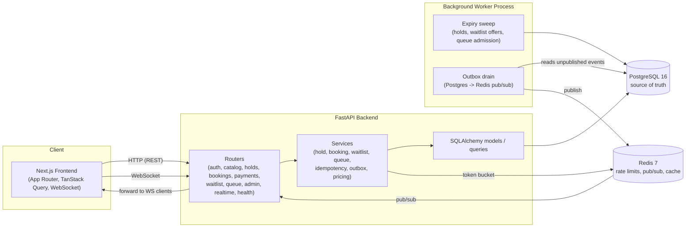
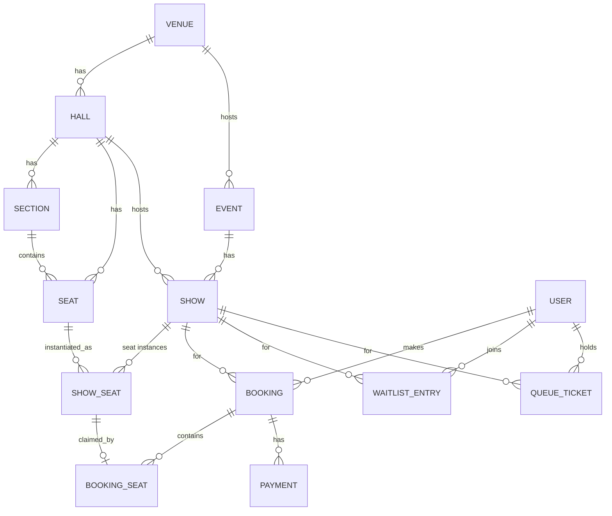

# Architecture



## Request lifecycle: booking a seat

```mermaid
sequenceDiagram
    participant U as User (browser)
    participant API as FastAPI
    participant DB as Postgres
    participant R as Redis
    participant W as Worker

    U->>API: POST /api/holds (Idempotency-Key, seat_ids)
    API->>DB: BEGIN; conditional UPDATE per seat (status='FREE'->'HELD')
    alt all seats acquired
        DB-->>API: success
        API->>DB: INSERT outbox_events(booking.held)
        API->>DB: COMMIT
        API-->>U: 201 Booking{status: HELD, expires_at}
    else any seat unavailable
        DB-->>API: 0 rows affected for that seat
        API->>DB: ROLLBACK
        API-->>U: 409 Conflict {unavailable seat_ids}
    end

    par outbox drain
        W->>DB: SELECT unpublished outbox_events
        W->>R: PUBLISH show:{id}:events
        R-->>API: pub/sub message
        API-->>U: WebSocket: seat now HELD
    end

    U->>API: POST /api/bookings/pay
    API->>DB: status HELD -> PAYMENT_PENDING
    API->>API: mock_payment_provider.charge() (async)
    Note over API: webhook arrives later (success/fail/timeout/duplicate)
    API->>DB: handle_webhook: lock booking FOR UPDATE, validate transition, confirm or fail
```

## Data model (entity overview)


